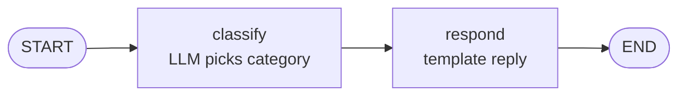
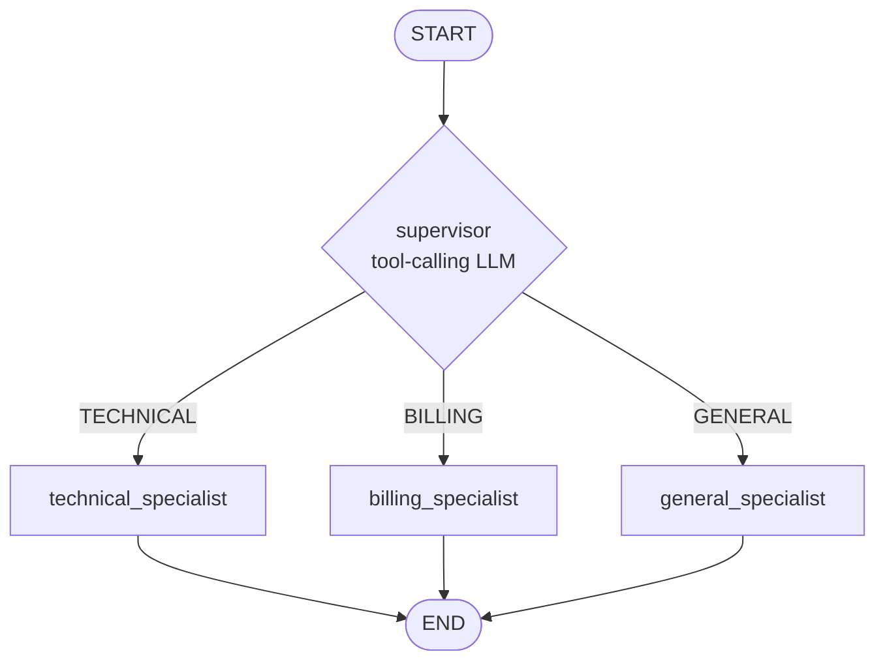
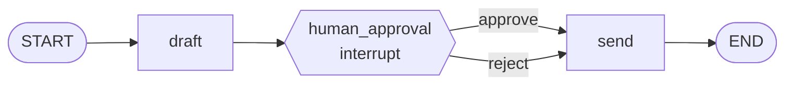
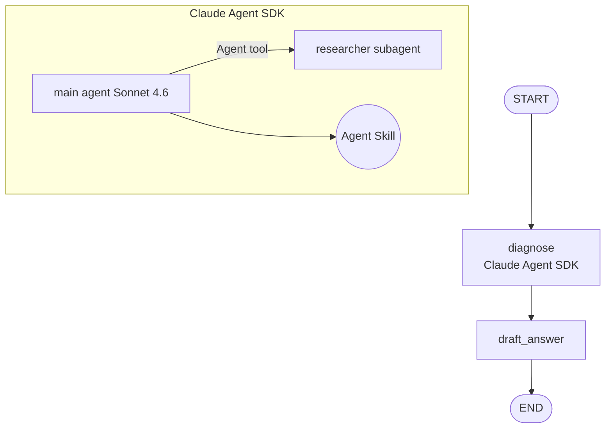

# Week 10 — 3-Hour Agenda

Print this or keep it on a second monitor during class.

| Time | Duration | Block | Pre-loaded tab |
|-----:|---------:|-------|----------------|
| 18:00 | 0:10 | Kick-off + `verify_setup.py` | Terminal |
| 18:10 | 0:25 | Theory: digital assembly lines + 5 production patterns | Slide 3 |
| 18:35 | 0:25 | **Ex 1** — Hello StateGraph | `01_hello_graph.py` |
| 19:00 | 0:30 | **Ex 2** — Tool-calling supervisor | `02_supervisor.py` |
| 19:30 | 0:10 | Break | — |
| 19:40 | 0:25 | **Ex 3** — Checkpointing + HITL | `03_checkpointing.py` |
| 20:05 | 0:20 | **Ex 4** — LangSmith tracing | `04_langsmith.py` + smith.langchain.com |
| 20:25 | 0:20 | **Ex 5** — Claude Agent SDK hybrid | `05_hybrid_sdk.py` |
| 20:45 | 0:10 | Show & Tell (3 volunteers) | — |
| 20:55 | 0:05 | W11 preview + closing Q&A | Slide 19 |
| 21:00 | — | Done | — |

## Slide deck outline (19 slides — use Gamma or Google Slides)

1. Title — Week 10 · LangGraph Orchestration
2. Agenda — paste table above
3. Theory: Digital assembly lines (Anthropic 2026 framing)
4. 5 production patterns — State · Cost · Infra · Subagents · Skills
5. Why LangGraph — LangChain+LangGraph ecosystem 90M monthly downloads, production at Uber/JPMorgan/BlackRock/Cisco/LinkedIn/Klarna, Gartner 40% by end-2026
6. Graphs, typed state, conditional routing (one diagram)
7. CrewAI vs LangGraph — role-based vs state-machine
8. Ex 1 briefing — SupportState + classify + router
9. Ex 2 briefing — tool-calling supervisor (Apr 2026 pattern)
10. Ex 3 briefing — SqliteSaver + `interrupt()` = production durability
11. Break
12. Ex 4 briefing — LangSmith: every run traced, diff'd, priced
13. Ex 5 briefing — Claude Agent SDK + Skills + Subagent + Managed Agents (Apr 8 2026)
14. Model hierarchy: GPT-OSS 120B free (primary via OpenRouter, 20 RPM / 50 RPD per model) · swap lane (Qwen3 Coder free / DeepSeek R1 free / GLM 4.6 free / Llama 3.3 70B free / paid Gemini) · Claude Sonnet 4.6 (Ex 5)
15. Show & Tell — 3 demos, 3 minutes each
16. Homework
17. W11 preview — Swarm intelligence
18. References
19. Closing — "Today's Support Ticket graph is the template for every digital assembly line we ship in 2026."

## Presenter cheat sheet (60-second recaps)

- **Ex 1:** "State is a TypedDict. Nodes mutate it. Edges connect them. Compile. Invoke. That's the whole primitive."
- **Ex 2:** "LangChain's April 2026 guidance: the supervisor is just an LLM that calls tools. The tools are your specialists. Simple beats the library."
- **Ex 3:** "SqliteSaver writes state after every node. `interrupt()` pauses the graph. `Command(resume=...)` unpauses it. Your agents now survive restarts and humans."
- **Ex 4:** "Every trace is inputs, outputs, tokens, latency, state diff. If you can't see it, you can't fix it — and you can't cost-control it."
- **Ex 5:** "LangGraph runs the workflow, Claude Agent SDK runs the agents inside each node. Skills package knowledge. Subagents isolate context. Managed Agents removes infra."

## Common student confusions + quick answers

- **Graph runs twice / infinite loops** → Missing `END` edge. `graph.add_edge("last_node", END)`.
- **TypedDict fields not updating** → Return a dict with only the changed field. Don't mutate.
- **`interrupt()` doesn't pause** → Forgot to compile with `checkpointer=memory`.
- **LangSmith traces missing** → `LANGSMITH_TRACING=true` must be set BEFORE importing langchain. Restart kernel.
- **OpenRouter tool calling fails** → check `OPENROUTER_API_KEY` is set and the `base_url="https://openrouter.ai/api/v1"` is present in the `ChatOpenAI()` call.

## If this breaks (fallbacks)

- Student env fails → pair with neighbor, `cp solutions/01_hello_graph_solution.py notebooks/01_hello_graph.py` to catch up.
- LangSmith unreachable → skip to Ex 5 early, loop back if time.
- Ex 5 SDK install broken or event-loop error → demo mode (you run, they watch); if your own demo breaks, show the pre-recorded screencap.
- **Ex 5 MCP-leak risk (presenter laptop)** → if your laptop has private MCP servers registered (internal DBs, CRM, HR), the SDK subprocess may enumerate those tool names even with `setting_sources=[]`. Do not run Ex 5 live from your own machine. Options: (1) pre-record a clean screencap from a fresh profile; (2) run from a clean VM; (3) present Ex 5 as slides-only.
- Class running long → cut Ex 4 challenge; keep everything else.
- **Students hit 429 rate limits in Ex 2** → tell them to swap to a different free model (edit the `model=` line to `qwen/qwen3-coder:free`, `deepseek/deepseek-r1-0528:free`, or `z-ai/glm-4.6:free`); each free model has its own quota so rotating extends capacity.

## Plan B timing (if you slip ~15-20 min behind)

Slip detection points:
- End of env check past 18:15 → you're already 5 min over; expect to slip more
- End of Ex 2 past 19:35 → you're 15+ min behind; cut now

Cuts in priority order (preserve the critical path):
1. **First cut** — Ex 4 CHALLENGE (keep weak-vs-strong demo, cut the 20-ticket eval). Saves ~5 min.
2. **Second cut** — Ex 5 live-build → slide walkthrough only (show the code + screencap, skip running it). Saves ~15 min.
3. **Never cut** — Show & Tell. It's where team momentum and peer learning live.

## Visuals (Mermaid — paste into Gamma / Notion / slides)

### Ex 1

### Ex 2

### Ex 3

### Ex 5

## Post-class checklist

- [ ] Merge any Ex challenge PRs students opened
- [ ] Post Show & Tell highlights to team channel
- [ ] Send `HOMEWORK.md` to LINE group
- [ ] Update `agenticaicodingfitness` repo `week10/` with final code
- [ ] Write 3-bullet retro: what worked / what broke / what to change for W11
- [ ] Book a room for W11 Swarm
